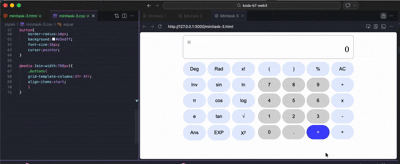

# Scientific Calculator – Minitask 3

This project is a **Scientific Calculator** web application built with HTML, CSS, and JavaScript. It features a modern UI and supports both basic and scientific operations.

## File Structure

- `minitask-3.html` – Main HTML file for the calculator UI.
- `styles/minitask-3.css` – Stylesheet for the calculator.
- `result.gif` – Demo of the calculator in action (see below).

## Demo

Below is a demonstration of the calculator in use:

